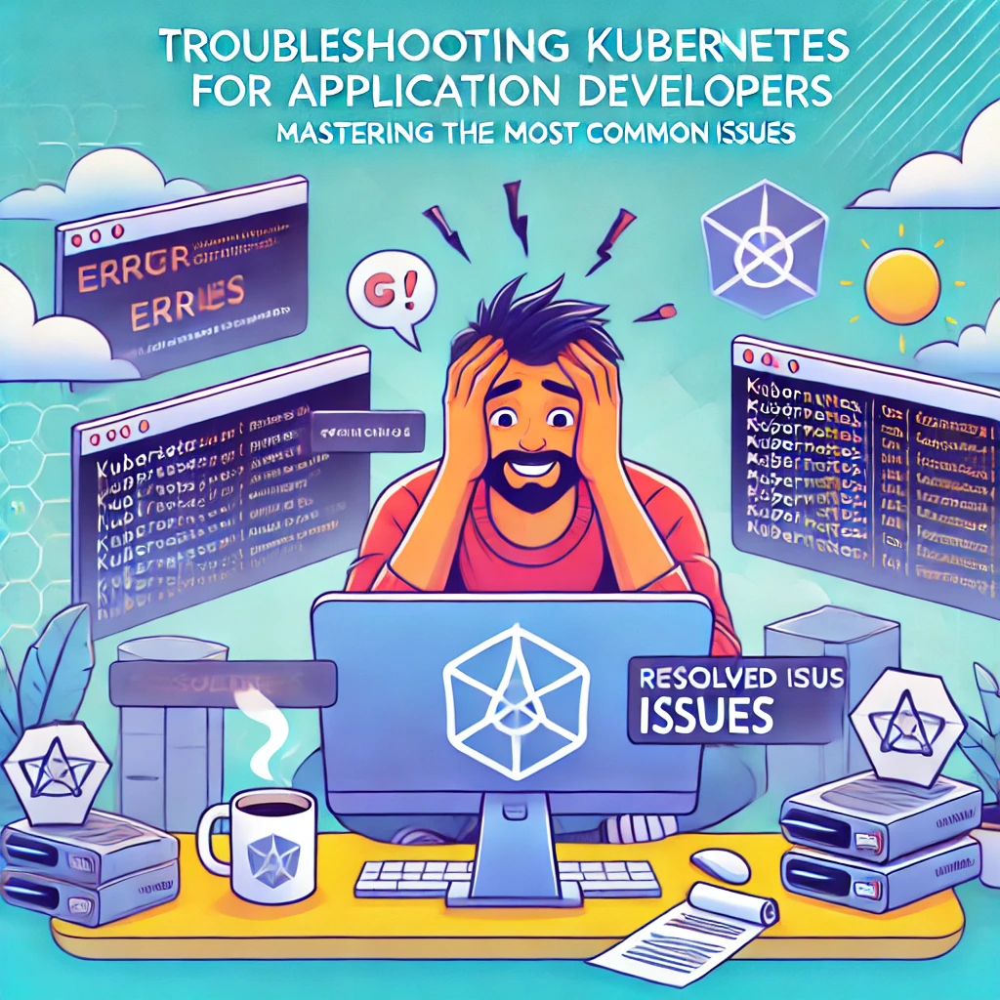

# kubernetes-debug-toolkit
## "Your go-to Resource for Seamlessly Debugging Kubernetes clusters and Tackling Operational Challenges with Confidence."

## Index
- 1 [Introduction: Troubleshooting Kubernetes for Application Developers →](./1_introduction_updated.md)
- 2   [Next Article: Deep Dive into kubectl get Commands →](./2_kubectl_get.md)
- 3   [Next Article: Deep Dive into kubectl describe Commands →](./3_kubectl_describe.md)
- 4   [Next Article: Deep Dive into kubectl events Commands →](./4_kubectl_events.md)
- 5   [Next Article: Deep Dive into kubectl logs Commands →](./5_kubectl_logs.md)
- 6   [Next Article: Deep Dive into exited codes →](./6_exited_codes.md)
- 7   [Next Article: Deep Dive into kubectl exec command →](./7_exec.md)
- 8-a [Next Article: Deep Dive into k8s Most Common Issues Part-1→](./8_1_kubectl-common.md)
- 8-b [Next Article: Deep Dive into k8s Most Common Issues Part-2→](./8_2_kubectl-common.md)
- 9   [Next Article: Deep Dive into kubectl debug Commands →](./9_kubectl-debug.md)
- 10  [Next Article: Deep Dive into kubectl port-foward & serviceaccount commands →](./10_kubectl-port-forward.md)
- 11  [Next Article: Deep Dive into kubectl ingress & networkpolicy →](./11_kubectl-ingress-netpol.md)
- 12  [Next Article: Deep Dive into kubectl RBAC & auth →](./12_kubectl-rback-auth.md)
- 13  [Next Article: Conclusion: Troubleshooting Kubernetes for Application Developers  →](./conclusion.md)
